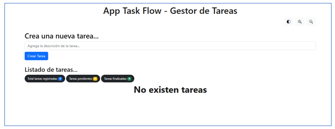
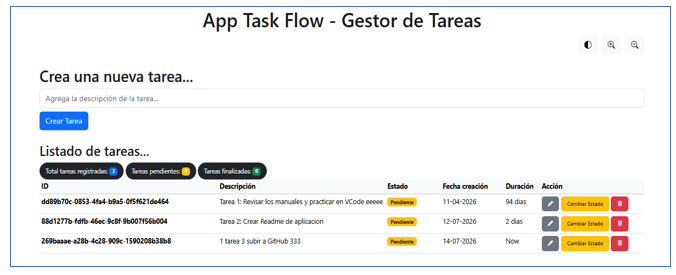
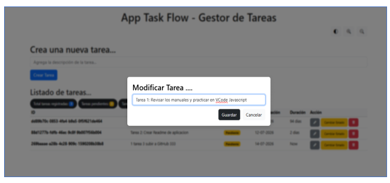
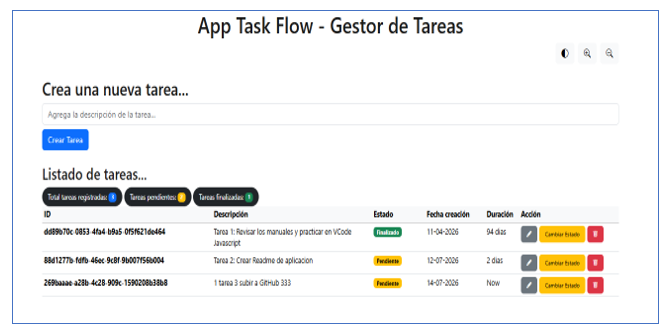
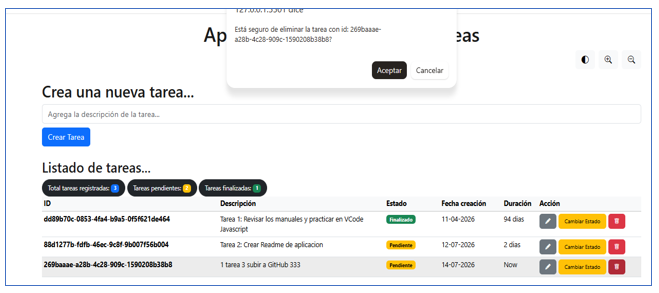
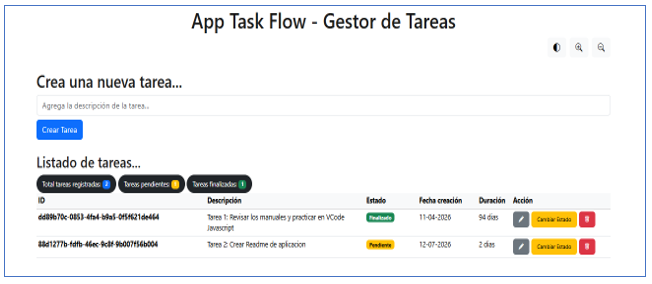

# Task Flow - Gestor de Tareas

"Task Flow - Gestor de Tareas" es una aplicación web sencilla y funcional para gestionar tareas diarias. Permite crear nuevas tareas, modificar su descripción, cambiar su estado entre pendiente y finalizado, eliminarlas y además, visualizar un resumen general del progreso.

## Descripción general

Esta aplicación está desarrollada con JavaScript puro, utilizando principios de programación orientada a objetos con clases para organizar la lógica del gestor de tareas. Además, incorpora una configuración de usuario para personalizar la experiencia visual, como el modo oscuro y el tamaño de letra.

## Funcionalidades principales

- Crear nuevas tareas desde un formulario.
- Mostrar un listado dinámico de tareas.
- Modificar descripción de las tareas pendientes.
- Cambiar el estado de una tarea entre:
  - Pendiente
  - Finalizado
- Eliminar tareas del listado.
- Mostrar un resumen de:
  - Total de tareas registradas
  - Tareas pendientes
  - Tareas finalizadas
- Persistencia de datos mediante LocalStorage.

## Tecnologías utilizadas

- HTML5
- CSS3
- JavaScript
- Bootstrap
- Moment.js
- LocalStorage

## Estructura del proyecto

- index.html: estructura principal de la interfaz.
- assets/js/script.js: lógica principal de la aplicación, eventos y renderizado.
- assets/js/configuracion-usuario.js: configuración de usuario (modo oscuro y tamaño de letra).
- assets/js/clases/GestorTareas.js: clase encargada de gestionar las tareas.
- assets/js/clases/Tarea.js: clase que representa cada tarea.
- assets/css/style.css: estilos personalizados de la aplicación.

## Cómo usar la aplicación

1. Abre el archivo index.html en tu navegador.
2. Ingresa una nueva tarea en el formulario.
3. Observa cómo se agrega al listado.
4. Usa los botones para:
   - cambiar el estado de una tarea,
   - eliminar una tarea.
5. Revisa el resumen visual de tareas en la parte superior del listado.

## Capturas o evidencias de funcionamiento

### Vista principal

### Creación de tareas

### Modificar descripción

### Modificar estado 

### Eliminar tarea 

## Nota

Este proyecto puede ampliarse agregando integración con una base de datos en el futuro.

## Contacto

- Autor : Ramon Pierola  --  ramon.pierola@gmail.com   --- Santiago julio-2026
- Aplicación realizada para el curso: Desarrollo de aplicaciones Full Stack JavaScript Trainee - Modulo-4
- Profesor: Nelson Ramírez
